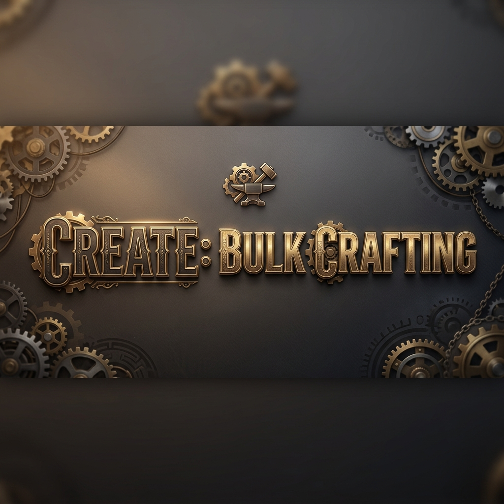

  
  
  <h1>Create: Bulk Crafting</h1>
  
<strong>Supercharge your automated processing! Process entire batches of Basin recipes in a single cycle.</strong>

  

---

## 🚀 What is Create: Bulk Crafting?

**Create: Bulk Crafting** is an addon for **Create (NeoForge 1.21.1)** that removes artificial bottlenecks on Basin processing machines like the **Mechanical Mixer** and **Mechanical Press**. 

In vanilla Create, a Mechanical Mixer or Press operating on a Basin processes exactly **1 recipe operation** per animation cycle, even if the Basin contains several stacks of ingredients. When dealing with large high-throughput factory lines, this slows down alloy creation and compounding to a crawl.

With **Create: Bulk Crafting**, machines operating on Basins will now **consume and produce multiples of ingredients simultaneously**, scaling up to whatever quantity is present in the Basin in a **single animation cycle**!

---

## ⭐ Key Features

### 🔥 Instantaneous Bulk Processing
* **Multi-Unit Execution**: If an alloy recipe requires `1 Cobblestone` and `1 Gold Nugget`, and your Basin holds `38 Cobblestone` and `64 Gold Nuggets`, the machine will execute 38 operations in a single spin—consuming 38 of each ingredient and producing 38 output items simultaneously!
* **Zero Speed Penalty**: All batch operations run at your machine's standard rotational speed without increasing kinetic duration or stress consumption.
* **Universal Compatibility**: Works automatically with any machine that inherits from Create's `BasinOperatingBlockEntity`—including Mechanical Mixers, Mechanical Presses working on Basins, and custom addon processing machines!

### 📦 Smart Spout & Chute Consolidation
* **Batched Output Drops**: Previously, rapid recipe operations generated dozens of fragmented stacks of size 1, causing chutes and funnels to drop output items one at a time over dozens of ticks.
* **Automatic Buffer Compression**: Create: Bulk Crafting intelligently compresses and merges output items into full stacks (up to 64 items) before they exit through Basin funnels or spouts. When dropping into a Chute, Depot, or Belt below, it deposits completely consolidated stacks instantly!

### 🛡️ Built-In Safety Controls
* Includes a defensive cap of **100,000 operations per single cycle** to protect servers and prevent infinite loops from external mod generator recipes or zero-cost crafting logic.

---

## 🛠️ Requirements & Compatibility

| Requirement | Version |
| :--- | :--- |
| **Minecraft** | `1.21.1` |
| **Mod Loader** | `NeoForge (21.1+)` |
| **Required Mod** | `Create (6.0.10+)` |

---

## 📥 Installation & Setup
1. Ensure you have installed **NeoForge 1.21.1** and **Create 6.0.10** (or higher).
2. Download `bulk_crafting-1.21.1-1.0.1.jar` from the releases or Modrinth page.
3. Drop the `.jar` file into your Minecraft instance's `mods` folder.
4. Launch the game and enjoy unrestricted factory throughput!

---

## 📝 License
This project is licensed under the **MIT License**. Feel free to use it in any modpack!
